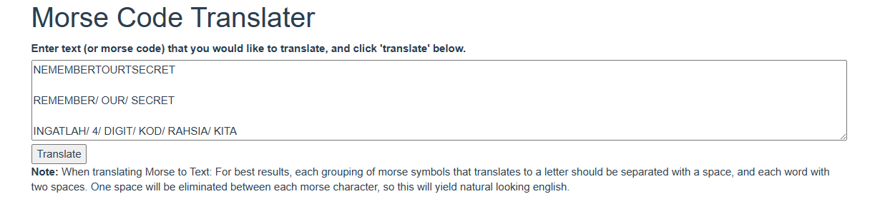
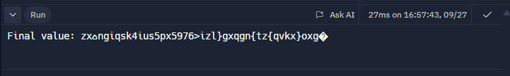

Welcome to my write-up for the 3108 CTF: Warkah Untuk Perwira organized by BahteraSiber. This CTF presented numerous smaller challenges, but I will be focusing on providing in-depth writeups of the main challenges that highlight key ethical hacking methodologies.

# Tugasan Utama

## Tugasan I: Seruan Perwira


It seems like a local hacker group called ITSLOKI has been threatening Malaysia's cybersecurity landscape, their motivations is mainly about revenge as their efforts have been stopped by the government before. Lee, working as a spy sends us a link saying that we must analyze a certain file in that link. Let's open it right away...

> https://www.youtube.com/watch?v=DFBNEsKJW6I&ab_channel=BahteraSiberMY


It seems that the video is from the ITSLOKI group stating that they possess a large sums of local and are threatening to sell all the data. He is challenging others to stop him! In the video description, there seems to be a download link which is given by Lee from earlier. Let's download and analyze the file.

It is a zip file, so we extract it to see the contents, and it seems to be an eml file which is **an electronic mail format or email saved in plain text.** There is also an zipped attachment inside the email.


Inside appears to be a morse code, let's try to decrypt it right away.



We assume that the secret 4 digit code is 3108. Let's keep that in mind and let's now try to extract the attachment in the email.


There seems to be two files inside, an image file and a flag.txt file. Now if we try to extract, it asks for a password. With the earlier hint, we entered "3108"" as the password and we get the flag for the first part of the task. The flag is **3108{1E2A3C68CC5C0207886EDE403EEF230DC7C0FBD0}**


## Tugasan II: Tali Barut

git 

The task seems to hint us at performing some OSINT on the ITSLOKI group to find out more information about them. The group seems to have been promoting hacking classes on social media with the intention of recruiting more black hat hackers on their side. Sambanthan tells us that he has left multiple files and secret message for us to analyze in a server.

Inspecting the image earlier that we got from the eml file, there seems to be names of the ITSLOKI members. So let's start with that, we try to look for the next clue through searching social media using their usernames on the image.


After doing some OSINT, we find this account @p3tualang on TikTok. After checking out all the videos one by one.. we find that there is a discord link in one of the posts. Let's enter their group to investigate further.


Now that we have entered in their discord, let's see if there any further clues, and remember that Sambathan has left us some secret messages and files. Let's try to find that by going through all the channels one by one.


After examining all the channels, what caught our eyes are what appears to be some secret message in the "TOPI HITAM" channel category.


It seems to be some sort of cipher, and there is the number **31** and **08** which seems to indicate that this is a encrypted flag. We just need to find out what type of encryption is this and try to decrypt it. First, let's combine all of this into a proper order. The code which contains 31 probably precedes the 08. It will look something like this.

`baabbaaaaaaabbbabbababaaaaaaaaaabbb abbbbaabaabaaabbabbaabaaabaaabaaaaa! aaaaaabbabaaabbaaaaa baabbaabaaababbaaaaaaabbb abbaaaabaaabbababaabbabaaabbaaabbbbaaaaaabaaa abaabaaaaababbaaaaaaabbbbaaaaaabbab. 3108{baaba3abbabbaabb14baabaaaaaa_abbbb3ababaaaaaa}. abaaabaabbbaabaababbabbbaababaabaaa aabbababaaabbabaaaaa aaaba2 babaaabbabbaabbbabaaababa abbaaaabaaabbabbbaaaaabaabaaabaaaaaabbabaabba abbaaaaaaaababbaaaaabbaaabaabaabaaaaaaaa. aaabaaaaaabaaababaaa aabaaabbabaaababaaabbba aaabbbbbaabbaabaaaaabb baabbaabaababbbbaabb aaabbababbabbaa baabaaabaabaaabbababaabaabaaab aaabbabaaabaabaaaabaabbbabaaabaaabb abaaabaabbbaabaababbabbbaababaabaaa aaabbaaaaaabbab baabaaabaabaaabaaaaaabbabaabba baabaaabaabaaabbababaabaabaaab aaaba2 abbaaaabaabaaabaabaaababaaaaaa! -baabaaaaaaabbaaaaaabaaaaabaabbaabbbaaaaaabbab`


Using a tool to analyze the cipher text, it seems to be encrypted with Bacon Cipher. Let's try to decrypt it now.

**TAHNIAHPERWIRAANDATELAHMENJUMPAIJAWAPANSNTSAPKAITSLOKIGUNACUNTUKMENYERANGMALAYSIACARIENCRYPTEDTEXTDLMSERVERDISCORDITSLOKIDANSERANGSERVERCMEREKASAMBATHAN**

We get this when decrypting the message, however it still seems to be a little scrambled. This is probably because there are characters and numbers in the message which shouldn't be in a Bacon Cipher. Now let's try to remove all the unneeded characters and only focus on the flag part which starts with 3108{ }. Let's try to decrypt the text by breaking it down like this

`3108{baaba3abbabbaabb14baabaaaaaa_abbbb3ababaaaaaa}.`


Now the spaces should probably be replaced by the numbers in the original cipher text as Bacon Cipher should only contain 'a's and 'b's. Combining all of them yields us the second flag!

The flag is **3108{S3NT14SA_P3KA}**

## Tugasan III: Pangkalan Gelap


ITSLOKI seems to have a webserver which they operate to sell and leak hacked data. The task informs us that there is already someone that got into their server and has left us a message. It seems that we have to perform penetration testing into the box which hosts the web server. There are two ways to get the box which is through a Google Drive link and also a TryHackMe room. Let's now go back into the discord server to find some clues.

In the **#chat-biasa2** channel, there seems to be a python code. This python code seems to consist of index based references as can be seen with the **"a"** variable. There are also some syntax errors that we have to fix in order to get the actual string outputs.


And the output that we get is


[https://drive.google.com/file/d/1KyOkNvQ9Z53AAlF_M52DjAeKf9YiN8-U/view](https://drive.google.com/file/d/1KyOkNvQ9Z53AAlF_M52DjAeKf9YiN8-U/view)


The downloadable file is an .ova file which is a virtual appliance package file that contains files for distribution of software that runs on a virtual machine. This is probably the box containing the web server belonging to ITSLOKI and we can access it by running it on a hypervisor software like VirtualBox.

In the **#rat** channel, there seems to be a broken C code. Let's fix it and try to run it to see the output of the code.


Now that the code has been fixed, let's try to run it now.



The output that we get is


It seems to be a ROT ciphertext, decrypting it yields us a TryHackMe room.

>[tryhackme](https://tryhackme.com/jr/3108ctfwarkahuntukperwira)


We now have two ways to access their server as stated earlier, which is via TryHackMe room or the box we downloaded. It doesn't matter which one we choose. Let's configure our attacking machine along with the box. Now the first step is to get the box's IP so that we can perform an nmap scan. The IP is **10.0.2.4**


Next, run a basic nmap scan `nmap -sC -sV 10.0.2.4`


In the nmap scan, we found a HTTP server on port 80. Let's now access the web server via a browser.


This means that we need to add this ip into our hosts file, but first we need to find out the original domain name of the web server. Let's now bruteforce the web server to find if there are interesting files and directories.


Using dirb, we found a file called **note.txt.** Now we can examine the contents of the text file.


**itsloki.bs** seems to be the original domain name for the server. Now we just need to insert this into our hosts file located at **/etc/hosts**


Now we can access the website in a browser via itsloki.bs


Let's first view the page source to find if there are any helpful hints..


In the page source, we found an interesting text that contains, what it looks to be someone's credentials. In the website, we can find the same name "**rok14h**" which is the author of the posts. Also another intesting thing to note is that the website is built using a content management system called ""Textpattern."

Let's again do some enumeration on the website now that we have its domain name. We will be bruteforcing for files and directories to see if there any ways we can get into the web.


We found the textpattern directory. Let's examine it.


It appears that this is the admin page of the textpattern CMS. We need some credentials to access this. We use the credentials obtained earlier in the page source of the website which is **rok14h:rok14h@l33t**


Next, let's inspect the admin page further to see if there any interesting things that we can potentially use to get into the box. It seems that there is an upload file functionality, we can possibly use this to do a reverse shell.


We can use this reverse shell php file that can be downloaded from here [https://github.com/xdayeh/Php-Reverse-Shell/blob/master/PHP-Reverse-Shell.php]()

In the code, we need to edit the ip and port to our own. We will use port 4444 


Next is to set up a netcat listener using the same port that we have entered.


Now let's upload the file and activate it by browsing into the file via a browser. It can be browsed here http://itsloki.bs/files (we found this directory earlier with dirb) and clicking on the file. 


Go back to the terminal and now we should have access to the box.


Next, let's find the flag by using the find command `find / -name "*.txt"` or `find / -iname "Flag*.txt"`


We have found the final flag! The flag is **3108{h4sil_bum!_d1r0b3k_dem1_kep3nt!ng4n_d1r1}**


## Bonus Merdeka Quest

> This is a small write up for the bonus Merdeka giveaway.
> {: .prompt-info }

Let's start by going into the google drive link provided. Download the files and examine the contents.


A quick analysis using these two commands.

```shell
cat info.txt
file dumb.raw
```


After examining, it seems like we would have to find a flag with the format 3108{FLAG} inside the .raw file which we further analyzed using the **file** command. We reckon that it might be a windows memory dump file.

For memory dumps, we can use volatility3 for further analysis... let's download the tool.

[https://github.com/volatilityfoundation/volatility3](https://github.com/volatilityfoundation/volatility3)

```shell
git clone https://github.com/volatilityfoundation/volatility3.git
cd volatility3
```

Start the tool and let's check out the help page to see what we can work with. Since we know this is a windows dump file, we will just focus on the windows plugins.

```shell
python3 vol.py -h
```


Considering that we would have to somehow find a flag, the flag text might be placed in a file. So, let's first scan for files by using the** windows.filescan** plugin. The plugin lists all the files that are in the memory dump.

```shell
vol.py -f dumb.raw windows.filescan 
```


After the scan finishes.. as a start, let's just try using the search function (CTRL + SHIFT + F) in the terminal to find any files named "flag"... and we found two files named **flag.rtf** and **flag or not.txt.**


Now that we found the flag files, we can examine the content by dumping the files using the **windows.dumpfiles **plugin. We take the respective offset number from the filescan results for each of the files so we can examine individually. We output the results in a folder we created name "files".

| Offset         | File name       |
| -------------- | --------------- |
| 0x96080108ec30 | flag.rtf        |
| 0x960802c47830 | flag_or_not.txt |

```shell
python3 vol.py -f dumb.raw -o ./files windows.dumpfiles --virtaddr 0x96080108ec30
python3 vol.py -f dumb.raw -o ./files windows.dumpfiles --virtaddr 0x960802c47830
```

Examine the content of the files in the folder that we outputted using a rich text format editor for the** .rtf **file.


The flag is **3108{MEMORY-DUMP}**
